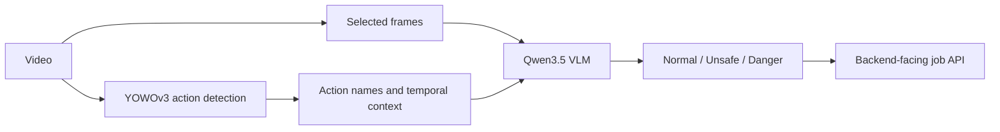

# ZroAct · Video-Language Safety Monitoring

A team capstone on CCTV intrusion risk detection. **Seong-U IM — AI Leader / modeling.**

A small vision-language model can receive only a few frames from a longer video. We used YOWOv3 action detections to supply additional action and temporal context, then asked a Qwen3.5 VLM to classify risk as `normal`, `unsafe`, or `danger`.

The team built a system connecting CCTV, a backend, an AI server, and a dashboard. This repository contains the AI pipeline, serving interface, and experiments. [Project roles and scope](docs/PORTFOLIO_NOTES.md) are described separately.

## Approach

Stage 1 extracts action information. Stage 2 uses that information together with selected frames for risk classification.



The current training code builds three-frame requests at `t, t+10, t+20` and adds top-2 action names with frame indices and times. At 30 fps, the sampled images span about 0.67 seconds. The serving configuration runs Stage 1 at a stride of 10 frames. Bounding-box ablations switch the image source; the current training prompt does not serialize box coordinates. See the [architecture](docs/ARCHITECTURE.md) and [implementation/evidence map](docs/RESULT_PROVENANCE.md).

## Experiments

The following results are recorded in the experiment reports. Raw predictions, data, and checkpoints are not included in this repository.

| Model / setting | Split | Requests | Accuracy | Macro F1 |
|---|---|---:|---:|---:|
| Qwen3.5-0.8B zero-shot | Test | 5,007 | 0.4757 | 0.2149 |
| Qwen3.5-0.8B LoRA, checkpoint-2794 | Validation | 4,924 | 0.9297 | 0.8454 |
| Qwen3.5-2B zero-shot | Test | 5,007 | 0.8870 | 0.6970 |

Sources: [experiment summary](docs/EXPERIMENTS_SUMMARY.md) and [detailed v2 report](benchmark2/training/V2_RESULTS_REPORT_KO.md). The LoRA row uses a different split from the zero-shot rows, so this table does not establish a matched performance gain. The 0.8B LoRA validation result has `unsafe` recall of 0.4614, a substantial remaining limitation.

The LoRA configuration uses rank/alpha 16/16, vision/language/attention/MLP adaptation, 3 epochs, effective batch 32, and learning rate `1e-4`. Prompt/component ablation tools are also included. Additional result tables still need to be matched to their original runs.

## Code and documentation

| Entry point | What it shows |
|---|---|
| [Project roles](docs/PORTFOLIO_NOTES.md) | Research motivation, personal role, and limitations |
| [Result provenance](docs/RESULT_PROVENANCE.md) | Model settings, result sources, and open questions |
| [Setup and run](docs/SETUP_AND_RUN.md) | A CPU-only synthetic example and requirements for real experiments |
| [Training guide](benchmark2/training/README.md) | Dataset construction, LoRA training, and evaluation |
| [Repository map](docs/REPOSITORY_STRUCTURE.md) | Experimental, sequential, streaming, and serving paths |

A small evaluation example requires only Python 3.10+ and no videos, model downloads, or API keys:

```bash
python3 benchmark2/scripts/evaluate_stage2_results.py \
  --gt-manifest docs/examples/mock_gt.jsonl \
  --results-csv docs/examples/mock_predictions.csv
```

This synthetic example checks the evaluator and file formats: 3 requests, with 2 correct predictions. It does not run a model.

Full reproduction remains incomplete: the public checkout lacks the private dataset and annotations, fixed video split file, YOWOv3 source/checkpoint, and VLM/LoRA weights. The historical serving config also needs repair before running jobs. [Setup notes](docs/SETUP_AND_RUN.md) separate the available run modes and blockers.

## Limitations

- This is a task-specific intrusion-monitoring study; the reported metrics do not establish general industrial-safety performance.
- Stride-1 requests cover nearby moments in the same videos and are highly correlated. Request counts are not independent event counts.
- Video-level splits avoid sharing a video across train/validation/test; they do not by themselves establish generalization across cameras or sites.
- `pipeline_ver2/` contains streaming prototypes; no reproduced end-to-end latency claim is made here.
- Dataset release rights, checkpoint redistribution, and an appropriate project license still need to be established before distributing those artifacts. No reuse license is currently included.
