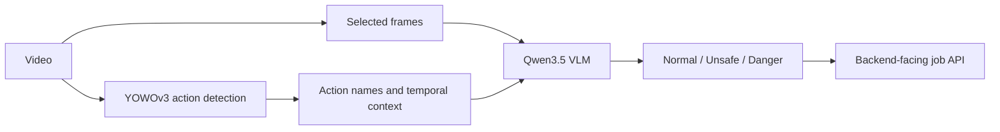

# ZroAct: Action-guided Video Risk Reasoning

**Research question:** How can a small vision-language model use temporal evidence when it can only receive a few frames from a longer CCTV video?

ZroAct is a **team capstone project** for industrial safety monitoring. It combines YOWOv3 action detections with sampled frames and temporal context, then uses a Qwen3.5 vision-language model to classify intrusion risk as `normal`, `unsafe`, or `danger`. The broader project includes backend and dashboard integration; this repository publishes the AI experiments, pipeline code, and backend-facing serving interface.

**My role — Seongwoo Lim:** AI Leader / modeling. The components below describe the team's implementation; they are not a claim that I independently authored the entire system. See [contribution scope](docs/PORTFOLIO_NOTES.md).

## Idea and implementation

The modeling idea is to pass compact action evidence alongside visual samples instead of asking the VLM to process every video frame directly.



The current training code builds three-frame requests at `t, t+10, t+20` and adds top-2 action names with frame indices and times. At 30 fps, the sampled images span about 0.67 seconds. The serving configuration samples Stage 1 every 10 frames; full-video temporal coverage is a design motivation, **not a claim that the current serving path evaluates every frame**. Bounding-box ablations switch the image source; the current training prompt does not serialize box coordinates. See the [architecture](docs/ARCHITECTURE.md) and [implementation/evidence map](docs/RESULT_PROVENANCE.md).

## Experiments recorded in this repository

These are **reported results from the committed documentation**, not results regenerated from the public checkout. Raw predictions, private data, and model checkpoints are absent.

| Model / setting | Split | Requests | Accuracy | Macro F1 |
|---|---|---:|---:|---:|
| Qwen3.5-0.8B zero-shot | Test | 5,007 | 0.4757 | 0.2149 |
| Qwen3.5-0.8B LoRA, checkpoint-2794 | Validation | 4,924 | 0.9297 | 0.8454 |
| Qwen3.5-2B zero-shot | Test | 5,007 | 0.8870 | 0.6970 |

Sources: [experiment summary](docs/EXPERIMENTS_SUMMARY.md) and [detailed v2 report](benchmark2/training/V2_RESULTS_REPORT_KO.md). The LoRA row uses a different split from the zero-shot rows, so this table does not establish a matched performance gain. The 0.8B LoRA validation result has `unsafe` recall of 0.4614, a substantial remaining limitation.

The LoRA configuration uses rank/alpha 16/16, vision/language/attention/MLP adaptation, 3 epochs, effective batch 32, and learning rate `1e-4`. Prompt and component ablation tools are included; their outcome tables require run-level provenance before being presented as verified public results.

## Read and run

| Entry point | What it shows |
|---|---|
| [Portfolio notes](docs/PORTFOLIO_NOTES.md) | Research motivation, personal role, and limitations |
| [Result provenance](docs/RESULT_PROVENANCE.md) | Which claims have code or recorded-result support |
| [Setup and run](docs/SETUP_AND_RUN.md) | A CPU-only synthetic example and requirements for real experiments |
| [Training guide](benchmark2/training/README.md) | Dataset construction, LoRA training, and evaluation |
| [Repository map](docs/REPOSITORY_STRUCTURE.md) | Experimental, sequential, streaming, and serving paths |

A small evaluation example requires only Python 3.10+ and no videos, model downloads, or API keys:

```bash
python3 benchmark2/scripts/evaluate_stage2_results.py \
  --gt-manifest docs/examples/mock_gt.jsonl \
  --results-csv docs/examples/mock_predictions.csv
```

The deliberately synthetic example evaluates 3 requests, with 2 correct predictions. It demonstrates file formats and the evaluation path; **it is not a research result or model-inference demo**.

Full reproduction remains incomplete: the public checkout lacks the private dataset and annotations, fixed video split file, YOWOv3 source/checkpoint, and VLM/LoRA weights. The historical serving config also needs repair before running jobs. [Setup notes](docs/SETUP_AND_RUN.md) separate the available run modes and blockers.

## Research scope and limitations

- This is a task-specific intrusion-monitoring study; the reported metrics do not establish general industrial-safety performance.
- Stride-1 requests cover nearby moments in the same videos and are highly correlated. Request counts are not independent event counts.
- Video-level splits avoid sharing a video across train/validation/test; they do not by themselves establish generalization across cameras or sites.
- `pipeline_ver2/` contains streaming prototypes; no reproduced end-to-end latency claim is made here.
- Dataset release rights, checkpoint redistribution, and an appropriate project license still need to be established before distributing those artifacts. No reuse license is currently included.
